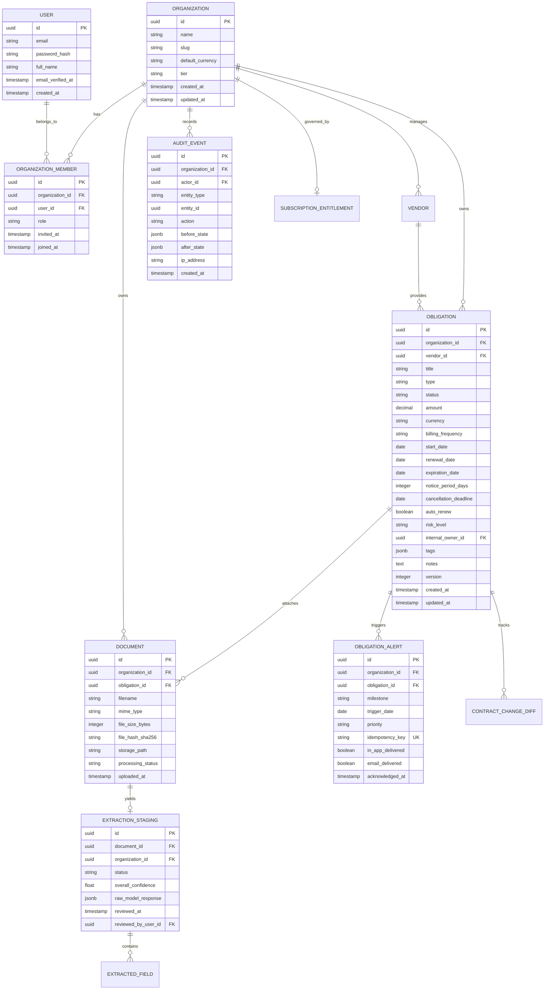

# Domain Data Model & Database Schema: RenewalRadar

**Feature**: [spec.md](./spec.md) | **Plan**: [plan.md](./plan.md)
**Date**: 2026-09-05
**Status**: Decided & Specified

---

## 1. Entity Relationship Overview (Mermaid)



---

## 2. Core Entities & Schema Definitions

### 2.1 `organizations`
Represents an isolated multi-tenant workspace.
- `id`: `UUID` (Primary Key, default `gen_random_uuid()`)
- `name`: `VARCHAR(255)` NOT NULL
- `slug`: `VARCHAR(100)` NOT NULL UNIQUE (URL-safe identifier)
- `default_currency`: `CHAR(3)` NOT NULL DEFAULT `'USD'` (ISO 4217 code)
- `tier`: `VARCHAR(50)` NOT NULL DEFAULT `'free'` (`free`, `business`, `pro`)
- `created_at`: `TIMESTAMPTZ` NOT NULL DEFAULT `NOW()`
- `updated_at`: `TIMESTAMPTZ` NOT NULL DEFAULT `NOW()`

### 2.2 `users` & `organization_members`
Authentication and Tenant Access Control.
- **`users`**:
  - `id`: `UUID` PK
  - `email`: `VARCHAR(255)` NOT NULL UNIQUE (lowercase, trimmed)
  - `password_hash`: `VARCHAR(255)` NOT NULL (Argon2id)
  - `full_name`: `VARCHAR(255)` NOT NULL
  - `email_verified_at`: `TIMESTAMPTZ` NULL
  - `created_at`: `TIMESTAMPTZ` NOT NULL DEFAULT `NOW()`
- **`organization_members`**:
  - `id`: `UUID` PK
  - `organization_id`: `UUID` NOT NULL REFERENCES `organizations(id)` ON DELETE CASCADE
  - `user_id`: `UUID` NOT NULL REFERENCES `users(id)` ON DELETE CASCADE
  - `role`: `VARCHAR(50)` NOT NULL (`owner`, `admin`, `member`, `viewer`)
  - `created_at`: `TIMESTAMPTZ` NOT NULL DEFAULT `NOW()`
  - *Unique Constraint*: `UNIQUE (organization_id, user_id)`

### 2.3 `obligations`
The core business obligation entity.
- `id`: `UUID` PK
- `organization_id`: `UUID` NOT NULL REFERENCES `organizations(id)` ON DELETE CASCADE
- `vendor_id`: `UUID` NULL REFERENCES `vendors(id)` ON DELETE SET NULL
- `title`: `VARCHAR(255)` NOT NULL
- `type`: `VARCHAR(50)` NOT NULL (`contract`, `subscription`, `license`, `permit`, `insurance`, `warranty`, `vendor_agreement`, `lease`, `other`)
- `status`: `VARCHAR(50)` NOT NULL DEFAULT `'active'` (`draft`, `active`, `under_review`, `notice_given`, `renewed`, `expired`, `terminated`, `archived`)
- `amount`: `NUMERIC(15, 2)` NOT NULL DEFAULT 0.00
- `currency`: `CHAR(3)` NOT NULL DEFAULT `'USD'` (ISO 4217)
- `billing_frequency`: `VARCHAR(50)` NOT NULL (`monthly`, `quarterly`, `annual`, `biennial`, `one_time`)
- `start_date`: `DATE` NULL
- `renewal_date`: `DATE` NOT NULL
- `expiration_date`: `DATE` NULL
- `notice_period_days`: `INTEGER` NOT NULL DEFAULT 30
- `cancellation_deadline`: `DATE` GENERATED ALWAYS AS (renewal_date - (notice_period_days || ' days')::interval) STORED
- `auto_renew`: `BOOLEAN` NOT NULL DEFAULT true
- `risk_level`: `VARCHAR(20)` NOT NULL DEFAULT `'low'` (`critical`, `high`, `medium`, `low`)
- `internal_owner_id`: `UUID` NULL REFERENCES `users(id)` ON DELETE SET NULL
- `tags`: `JSONB` NOT NULL DEFAULT `'[]'::jsonb`
- `notes`: `TEXT` NULL
- `version`: `INTEGER` NOT NULL DEFAULT 1
- `deleted_at`: `TIMESTAMPTZ` NULL (Soft delete)
- `created_at`: `TIMESTAMPTZ` NOT NULL DEFAULT `NOW()`
- `updated_at`: `TIMESTAMPTZ` NOT NULL DEFAULT `NOW()`

### 2.4 `documents` & `extraction_stagings`
Document storage and provisional AI extraction holding table.
- **`documents`**:
  - `id`: `UUID` PK
  - `organization_id`: `UUID` NOT NULL REFERENCES `organizations(id)` ON DELETE CASCADE
  - `obligation_id`: `UUID` NULL REFERENCES `obligations(id)` ON DELETE SET NULL
  - `filename`: `VARCHAR(255)` NOT NULL
  - `mime_type`: `VARCHAR(100)` NOT NULL
  - `file_size_bytes`: `BIGINT` NOT NULL
  - `file_hash_sha256`: `CHAR(64)` NOT NULL
  - `storage_path`: `VARCHAR(512)` NOT NULL
  - `processing_status`: `VARCHAR(50)` NOT NULL DEFAULT `'uploaded'` (`uploaded`, `processing`, `extracted`, `verified`, `failed`)
  - `uploaded_by`: `UUID` NOT NULL REFERENCES `users(id)`
  - `created_at`: `TIMESTAMPTZ` NOT NULL DEFAULT `NOW()`
- **`extraction_stagings`**:
  - `id`: `UUID` PK
  - `document_id`: `UUID` NOT NULL REFERENCES `documents(id)` ON DELETE CASCADE
  - `organization_id`: `UUID` NOT NULL REFERENCES `organizations(id)` ON DELETE CASCADE
  - `status`: `VARCHAR(50)` NOT NULL DEFAULT `'pending_review'` (`pending_review`, `confirmed`, `rejected`)
  - `overall_confidence`: `REAL` NOT NULL DEFAULT 0.0
  - `extracted_fields`: `JSONB` NOT NULL (Array of `{ field: string, value: any, confidence: number, page: number, snippet: string, confirmed_value: any }`)
  - `reviewed_by`: `UUID` NULL REFERENCES `users(id)`
  - `reviewed_at`: `TIMESTAMPTZ` NULL
  - `created_at`: `TIMESTAMPTZ` NOT NULL DEFAULT `NOW()`

### 2.5 `obligation_alerts` (Monitoring & Notifications)
Idempotent notification event record.
- `id`: `UUID` PK
- `organization_id`: `UUID` NOT NULL REFERENCES `organizations(id)` ON DELETE CASCADE
- `obligation_id`: `UUID` NOT NULL REFERENCES `obligations(id)` ON DELETE CASCADE
- `milestone`: `VARCHAR(50)` NOT NULL (`90_day`, `60_day`, `30_day`, `14_day`, `7_day`, `1_day`, `overdue`)
- `trigger_date`: `DATE` NOT NULL
- `priority`: `VARCHAR(20)` NOT NULL (`critical`, `high`, `medium`, `low`)
- `idempotency_key`: `VARCHAR(255)` NOT NULL UNIQUE (`org_id:obligation_id:milestone:trigger_date`)
- `in_app_delivered`: `BOOLEAN` NOT NULL DEFAULT false
- `email_delivered`: `BOOLEAN` NOT NULL DEFAULT false
- `acknowledged_at`: `TIMESTAMPTZ` NULL
- `acknowledged_by`: `UUID` NULL REFERENCES `users(id)`
- `created_at`: `TIMESTAMPTZ` NOT NULL DEFAULT `NOW()`

### 2.6 `audit_events`
Immutable record of all tenant mutations.
- `id`: `UUID` PK
- `organization_id`: `UUID` NOT NULL REFERENCES `organizations(id)` ON DELETE CASCADE
- `actor_id`: `UUID` NULL REFERENCES `users(id)` ON DELETE SET NULL
- `entity_type`: `VARCHAR(50)` NOT NULL (`obligation`, `document`, `member`, `organization`, `alert`)
- `entity_id`: `UUID` NOT NULL
- `action`: `VARCHAR(50)` NOT NULL (`created`, `updated`, `deleted`, `extracted`, `confirmed`, `escalated`)
- `before_state`: `JSONB` NULL
- `after_state`: `JSONB` NULL
- `ip_address`: `VARCHAR(45)` NULL
- `user_agent`: `VARCHAR(255)` NULL
- `created_at`: `TIMESTAMPTZ` NOT NULL DEFAULT `NOW()`

---

## 3. Obligation Lifecycle State Transitions

```
[Draft] ─────────► [Active] ─────────► [Notice_Given] ─────────► [Terminated]
   │                  │                       │
   │                  ▼                       ▼
   └───────────► [Under_Review]          [Renewed] ──► (Advances to next cycle)
                      │                       │
                      ▼                       ▼
                  [Archived]              [Expired]
```

- **Draft**: Initial entry during manual draft or pending document extraction review.
- **Active**: Confirmed, monitored obligation with calculated cancellation and renewal milestones.
- **Under_Review**: Marked when contract change detection uncovers a price increase or terms variation.
- **Notice_Given**: Formal termination or non-renewal notice dispatched to vendor; auto-renew disabled.
- **Renewed**: Obligation renewed for a subsequent term; creates historical archive entry and advances dates.
- **Expired / Terminated**: Obligation reached end of lifecycle.
- **Archived**: Read-only historical record retained for audit and compliance purposes.

---

## 4. Indexing & Partitioning Strategy

1. **Multi-Tenant Filter Performance**:
   - `CREATE INDEX idx_obligations_org_status ON obligations (organization_id, status) WHERE deleted_at IS NULL;`
   - `CREATE INDEX idx_obligations_cancellation ON obligations (organization_id, cancellation_deadline, status) WHERE deleted_at IS NULL;`
   - `CREATE INDEX idx_obligations_renewal ON obligations (organization_id, renewal_date, status) WHERE deleted_at IS NULL;`
2. **Monitoring Scanner Speed**:
   - `CREATE INDEX idx_monitoring_scan ON obligations (status, cancellation_deadline, renewal_date) WHERE deleted_at IS NULL AND status = 'active';`
3. **Idempotency Guarantee**:
   - `CREATE UNIQUE INDEX idx_alerts_idempotency ON obligation_alerts (idempotency_key);`
4. **Audit Trail Retrieval**:
   - `CREATE INDEX idx_audit_org_created ON audit_events (organization_id, created_at DESC);`
